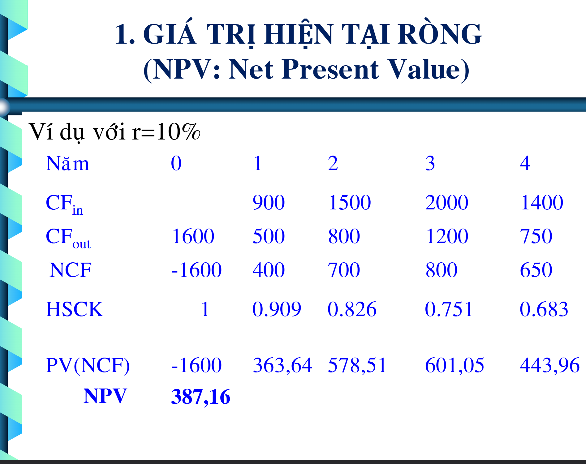
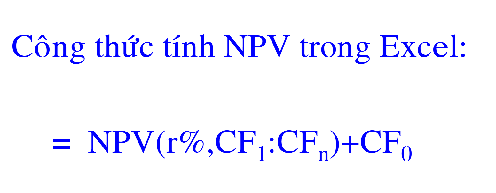

# 💼 Buổi 4 – CÁC CHỈ TIÊU ĐÁNH GIÁ DỰ ÁN  

## 📘 Tổng quan

Trong phân tích đầu tư, việc **đánh giá hiệu quả của dự án** là bước then chốt để ra quyết định **nên hay không nên đầu tư**.  
Buổi học này tập trung vào **4 chỉ tiêu quan trọng nhất**:

1. **NPV (Net Present Value)** – Giá trị hiện tại thuần  
2. **IRR (Internal Rate of Return)** – Tỷ suất hoàn vốn nội bộ  
3. **DPP (Discounted Payback Period)** – Thời gian hoàn vốn có chiết khấu  
4. **DSCR (Debt Service Coverage Ratio)** – Hệ số khả năng trả nợ  

---

## 🧭 Quan điểm tổng đầu tư

> “Quan điểm tổng đầu tư là **quan điểm tự do của ngân hàng**.”

Điều này nghĩa là: khi đánh giá dự án, ngân hàng (hoặc nhà đầu tư) cần xem xét **tất cả dòng tiền** phát sinh trong suốt vòng đời dự án, **không bị ràng buộc** bởi nguồn vốn nào cụ thể.

---

## 💰 1. NPV – Giá trị hiện tại thuần

### 🔹 Khái niệm

**NPV (Net Present Value)** là **chênh lệch giữa giá trị hiện tại của dòng tiền thu vào và dòng tiền chi ra**.  
Nó cho biết **giá trị tăng thêm** mà dự án tạo ra sau khi đã tính đến yếu tố thời gian và chi phí vốn.

> NPV = Tổng giá trị hiện tại của các dòng tiền trong tương lai – Chi phí đầu tư ban đầu  

---

### 📉 Giá trị hiện tại ròng


Giả sử một dự án có **1 năm đầu tư ban đầu và 4 năm hoạt động:**



Theo **giá hiện hành cuối mỗi năm**, các dòng tiền không thể so sánh trực tiếp vì **giá trị tiền tệ thay đổi theo thời gian**.  
Do đó cần **chiết khấu dòng tiền** bằng công thức:

\[
PV = \frac{1}{(1 + r)^t}
\]

Ví dụ:  
- Hệ số 0.909 ở năm 1 tương ứng với giá trị 0.909 của 1 đồng tại năm 0.  
- Cột **PV(NCF)** trong bảng thể hiện giá trị hiện tại của dòng tiền ròng từng năm.  
- Tổng giá trị này chính là **NPV cuối cùng của dự án.**

---

### 🧮 Công thức tính NPV trong Excel



Cú pháp:
```excel
=NPV(rate, value1, [value2], ...) + Initial_Investment

Trong đó: rate là lãi suất chiết khấu, value là dòng tiền ròng từng năm, và Initial_Investment là giá trị âm (chi phí đầu tư ban đầu).

📏 Quy tắc ra quyết định đầu tư theo NPV
Giá trị NPV	Kết luận	Giải thích ngắn gọn
> 0	✅ Nên đầu tư	Dự án sinh lời, tăng giá trị doanh nghiệp
= 0	⚖️ Cân nhắc	Hòa vốn, không sinh giá trị thêm
< 0	❌ Không đầu tư	Dự án lỗ, giảm giá trị doanh nghiệp
💡 Diễn giải chi tiết
🔹 Dự án tốt (NPV > 0)

Dòng tiền thu về lớn hơn chi phí đầu tư.

Dự án tạo ra giá trị gia tăng cho nhà đầu tư, vượt chi phí cơ hội vốn.

👉 Nên đầu tư.

Ví dụ:
Đầu tư 1 tỷ đồng, lợi nhuận chiết khấu hiện tại = 1,2 tỷ
→ NPV = 1,2 – 1,0 = +0,2 tỷ → Dự án tốt.

❌ Dự án xấu (NPV < 0)

Dòng tiền thu về nhỏ hơn chi phí đầu tư.

Dự án làm giảm giá trị doanh nghiệp.

👉 Không nên đầu tư.

Ví dụ:
Đầu tư 1 tỷ, giá trị hiện tại thu về = 0,8 tỷ
→ NPV = 0,8 – 1,0 = –0,2 tỷ → Dự án xấu.

⚖️ Dự án hòa vốn (NPV = 0)

Giá trị hiện tại của dòng tiền bằng đúng chi phí đầu tư ban đầu.

Tức là IRR = suất chiết khấu (r).

Ý nghĩa:

Dự án không lời, không lỗ, chỉ hòa vốn.

Không tạo thêm giá trị, cũng không làm giảm giá trị.

Quyết định:

Lý thuyết: có thể chấp nhận hoặc từ chối.

Thực tế: nên từ chối, vì sai lệch nhỏ trong dự báo có thể khiến dự án lỗ.

⚙️ 2. IRR – Tỷ suất hoàn vốn nội bộ

IRR là mức lãi suất chiết khấu tại đó NPV = 0.
Nó phản ánh tỷ suất sinh lợi nội tại của dự án.

Nếu IRR > chi phí vốn (r) → Nên đầu tư
Nếu IRR < chi phí vốn (r) → Không nên đầu tư

💡 IRR là chỉ tiêu dễ hiểu với nhà đầu tư vì nó thể hiện “mức lãi suất thực tế” mà dự án đạt được.

⏳ 3. DPP – Thời gian hoàn vốn có chiết khấu

DPP (Discounted Payback Period) cho biết mất bao lâu để thu hồi vốn đầu tư ban đầu sau khi đã xét yếu tố thời gian (chiết khấu).

Dự án có DPP càng ngắn, tính thanh khoản càng cao, rủi ro càng thấp.
Tuy nhiên, DPP không phản ánh lợi nhuận sau thời gian hoàn vốn, nên cần kết hợp với NPV hoặc IRR.

💳 4. DSCR – Hệ số khả năng trả nợ

DSCR (Debt Service Coverage Ratio) là chỉ tiêu được các ngân hàng sử dụng để đánh giá khả năng trả nợ của dự án.

𝐷
𝑆
𝐶
𝑅
=
D
o
ˋ
ng ti
e
ˆ
ˋ
n thu
a
ˆ
ˋ
n (sau thu
e
ˆ
ˊ
 + kh
a
ˆ
ˊ
u hao)
Nợ g
o
ˆ
ˊ
c + L
a
˜
i vay phải trả trong n
a
˘
m
DSCR=
Nợ g
o
ˆ
ˊ
c + L
a
˜
i vay phải trả trong n
a
˘
m
D
o
ˋ
ng ti
e
ˆ
ˋ
n thu
a
ˆ
ˋ
n (sau thu
e
ˆ
ˊ
 + kh
a
ˆ
ˊ
u hao)
	​

Giá trị DSCR	Đánh giá
> 1	Dự án có khả năng trả nợ tốt
= 1	Dự án chỉ vừa đủ trả nợ
< 1	Dự án không đủ khả năng trả nợ

💡 Trong thực tế, ngân hàng thường yêu cầu DSCR ≥ 1.2 để đảm bảo an toàn tín dụng.

🧾 Tóm tắt toàn buổi
Chỉ tiêu	Ý nghĩa chính	Tiêu chuẩn chấp nhận	Nhận xét
NPV	Giá trị hiện tại thuần	NPV > 0	Thước đo giá trị tuyệt đối
IRR	Tỷ suất hoàn vốn nội bộ	IRR > r	Thước đo lợi nhuận tương đối
DPP	Thời gian hoàn vốn có chiết khấu	DPP càng ngắn càng tốt	Đo khả năng thu hồi vốn
DSCR	Khả năng trả nợ	DSCR ≥ 1.2	Đánh giá rủi ro tín dụng
🧠 Ghi nhớ

“Một dự án tốt không chỉ có NPV dương, mà còn cần IRR cao, DPP ngắn, và DSCR an toàn.”

✍️ Biên soạn: The Next Generation Team
📚 Môn học: Nguyên lý Thẩm định Giá
🏫 Trường: UEH – University of Economics Ho Chi Minh City


re